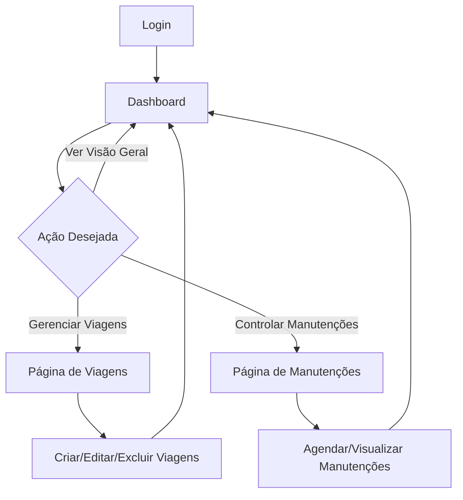

# 🚛 LogiTrack Pro

<div align="center">


**Sistema completo de gestão de frotas e logística**

[Documentação](#documentação) • [Demo](#demo) • [Reportar Bug](#reportar-bug) • [Solicitar Feature](#solicitar-feature)

</div>

---

## 📋 Sumário

- [Sobre o Projeto](#-sobre-o-projeto)
- [✨ Funcionalidades](#-funcionalidades)
- [🛠️ Stack Tecnológica](#️-stack-tecnológica)
- [🚀 Instalação](#-instalação)
- [⚙️ Configuração](#️-configuração)
- [📖 Uso](#-uso)
- [🐳 Docker](#-docker)
- [🤝 Contribuição](#-contribuição)
- [📄 Licença](#-licença)

---

## 🎯 Sobre o Projeto

LogiTrack Pro é uma aplicação web moderna desenvolvida para gerenciamento completo de frotas veiculares e operações logísticas. O sistema oferece uma interface intuitiva com dashboard em tempo real, gerenciamento de viagens, controle de manutenções e projeções financeiras.

### 🎨 Design & UX

- Interface moderna e responsiva com **Tailwind CSS**
- Componentes reutilizáveis com **shadcn/ui**
- Gráficos interativos com **Recharts**
- Experiência otimizada para desktop e mobile

---

## ✨ Funcionalidades

### 🏠 Dashboard Principal

- 📊 **Visão geral em tempo real** da frota
- 📈 **Gráficos interativos** de volume por categoria
- 🏆 **Ranking de utilização** de veículos
- 💰 **Projeções financeiras** automatizadas
- 🔧 **Cronograma de manutenções** próximas

### 🚗 Gestão de Viagens

- ➕ **Cadastro** de novas viagens
- 📋 **Listagem** com filtros e busca
- 📝 **Edição** de informações
- 🗑️ **Exclusão** segura com confirmação
- 📊 **Resumos** detalhados por viagem

### 🔧 Gestão de Manutenções

- ⚙️ **Agendamento** de manutenções
- 📅 **Cronograma** visual
- 🔔 **Alertas** de manutenções próximas
- 📋 **Histórico** completo
- 💸 **Controle** de custos

### 👤 Autenticação & Segurança

- 🔐 **Sistema de login** seguro
- 🛡️ **Proteção de rotas** autenticadas
- 🔄 **Auto-logout** em sessões expiradas
- 🍪 **Gerenciamento** de tokens

---

## 🛠️ Stack Tecnológica

<div align="center">

| Categoria            | Tecnologia                                                                                          |
| -------------------- | --------------------------------------------------------------------------------------------------- |
| **Framework**        |                |
| **Frontend**         |                       |
| **Linguagem**        |             |
| **Estilos**          |         |
| **UI Components**    |                          |
| **HTTP Client**      |                     |
| **State Management** |  |
| **Forms**            |            |
| **Charts**           |            |
| **Icons**            |           |
| **Validation**       |                          |

</div>

---

## 🚀 Instalação

### 📋 Pré-requisitos

- **Node.js** 18+
- **pnpm** (recomendado) ou **npm/yarn**

### 🔧 Passo a Passo

1. **Clone o repositório**

   ```bash
   git clone https://github.com/BrunoRobMaia/LogiTrack-Frontend.git
   ```

2. **Instale as dependências**

   ```bash
   # Recomendado
   pnpm install

   # Alternativas
   npm install
   yarn install
   ```

3. **Configure as variáveis de ambiente**

   ```bash
   cp .env.example .env.local
   ```

   Edite o arquivo `.env.local`:

   ```env
   NEXT_PUBLIC_API_URL=http://localhost:8080/api
   ```

4. **Inicie o servidor de desenvolvimento**

   ```bash
   # Com pnpm (recomendado)
   pnpm dev

   # Alternativas
   npm run dev
   yarn dev
   ```

5. **Abra no navegador**
   ```
   http://localhost:3000
   ```

---

## ⚙️ Configuração

### 📁 Estrutura do Projeto

```
src/
├── app/                    # App Router (Next.js 13+)
│   ├── (auth)/            # Rotas de autenticação
│   ├── (private)/         # Rotas protegidas
│   ├── globals.css        # Estilos globais
│   ├── layout.tsx         # Layout principal
│   └── page.tsx           # Home (redirect para login)
├── components/            # Componentes React
│   ├── ui/               # Componentes UI (shadcn/ui)
│   ├── CardResumoManutencao/
│   ├── CardResumoViagem/
│   ├── CronogramaManutencao/
│   ├── Header/
│   └── ...
├── context/              # Contextos React
│   └── AuthContext.tsx   # Contexto de autenticação
├── lib/                  # Utilitários
│   ├── api.ts           # Cliente HTTP axios
│   ├── auth.ts          # Funções de autenticação
│   └── utils.ts         # Utilitários gerais
└── types/               # Tipos TypeScript
    ├── dashboard.ts
    ├── manutencao.ts
    └── projecaoo.ts
```

### 🔗 Configuração da API

O projeto espera uma API REST backend configurada na variável `NEXT_PUBLIC_API_URL`. A API deve fornecer os seguintes endpoints:

- `POST /auth/register` - Registrar usuário
- `POST /auth/login` - Autenticação
- `GET /dashboard` - Dados do dashboard
- `GET /manutencoes/proximas` - Manutenções próximas
- `GET /manutencoes` - Lista completa de manutenções
- `POST /manutencoes` - Criar manutenção
- `PUT /manutencoes/:id` - Atualizar manutenção
- `DELETE /manutencoes/:id` - Excluir manutenção
- `GET /projecao/financeira` - Projeções financeiras
- `GET /viagens` - Lista de viagens
- `POST /viagens` - Criar viagem
- `PUT /viagens/:id` - Atualizar viagem
- `DELETE /viagens/:id` - Excluir viagem

---

## 📖 Uso

### 🏠 Navegação

#### 📋 Rotas do Sistema

**🔐 Autenticação (Pública)**

- `/` - Home (redirect para `/login`)
- `/login` - Página de login
- `/register` - Página de registro

**🏠 Dashboard (Privada)**

- `/dashboard` - Painel principal com visão geral

**🚗 Gestão de Viagens (Privada)**

- `/viagens` - Listagem e gerenciamento de viagens

**🔧 Gestão de Manutenções (Privada)**

- `/manutencao` - Listagem e agendamento de manutenções

#### 🎯 Fluxo de Navegação

1. **Acesso inicial**: Redirecionado para `/login`
2. **Após login**: Redirecionado para `/dashboard`
3. **Navegação**: Menu superior com acesso rápido para viagens e manutenções
4. **Logout**: Retorna para `/login`

### 🎯 Fluxo de Uso Típico



### 🔐 Autenticação

O sistema utiliza JWT tokens para autenticação:

- **Token Storage**: LocalStorage
- **Auto-refresh**: Configurável
- **Logout automático**: Em 401 responses

---

## 🐳 Docker

### 🏗️ Build e Execução

1. **Build da imagem**

   ```bash
   docker-compose up -d
   ```

2. **Acesso**
   ```
   http://localhost:3000
   ```

## 🤝 Contribuição

Contribuições são bem-vindas! Por favor:

1. **Fork** o projeto
2. **Crie** uma branch para sua feature (`git checkout -b feature/nova-funcionalidade`)
3. **Commit** suas mudanças (`git commit -m 'Adiciona nova funcionalidade'`)
4. **Push** para a branch (`git push origin feature/nova-funcionalidade`)
5. **Abra** um Pull Request

### 📝 Código de Conduta

- Seja respeitoso e profissional
- Siga os padrões de código existentes
- Adicione testes para novas funcionalidades
- Documente suas mudanças

---

## 🐛 Issues & Suporte

### 📝 Reportar Bugs

Ao reportar bugs, por favor inclua:

- ✅ **Descrição detalhada** do problema
- ✅ **Passos para reproduzir**
- ✅ **Ambiente** (SO, navegador, versão)
- ✅ **Screenshots** se aplicável
- ✅ **Logs** do console

### 💡 Solicitar Features

Para novas funcionalidades:

- 🎯 **Descreva** o caso de uso
- 💡 **Explique** o benefício
- 📋 **Sugira** implementação (opcional)

---

## 📄 Licença

Este projeto está licenciado sob a **MIT License** - veja o arquivo [LICENSE](LICENSE) para detalhes.

<div align="center">

**Desenvolvido por Bruno Roberto**

[](https://github.com/BrunoRobMaia)
[](https://www.linkedin.com/in/brunorobertomaia/)

</div>
